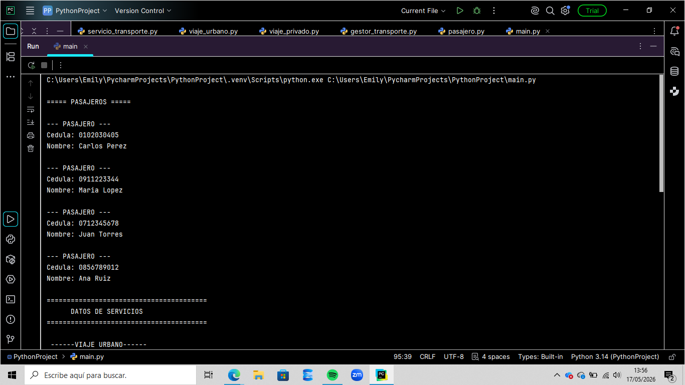
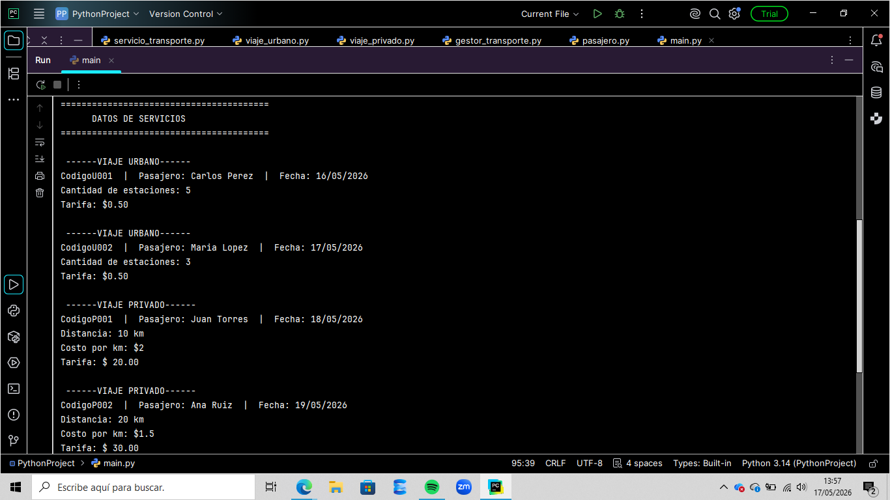
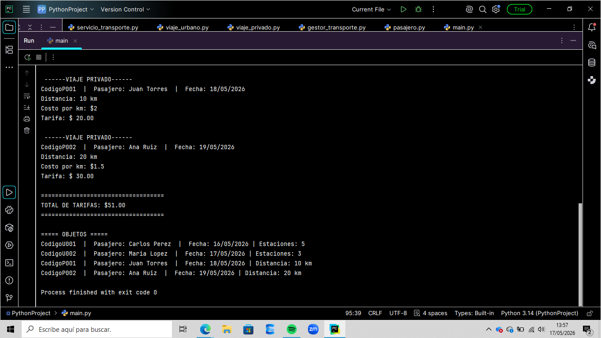

# Sistema de Gestión de Transporte

Proyecto desarrollado en Python utilizando **Programación Orientada a Objetos (POO)**.

El sistema permite registrar diferentes tipos de servicios de transporte aplicando conceptos como:

- **Herencia**
- **Encapsulamiento**
- **Polimorfismo**
- **Property y Setter**

---

# Características

- Encapsulamiento
- Herencia
- Polimorfismo
- Property y Setter
- Validaciones
- Método `__str__()`
- Modularización en archivos

---

# Estructura del Proyecto

```plaintext
ProyectoPOO/
│── servicio_transporte.py
│── viaje_urbano.py
│── viaje_privado.py
│── pasajero.py
│── gestor_transporte.py
│── main.py
└── README.md
```
```plaintext
# Explicación de Clases
ServicioTransporte
Clase base del sistema: Contiene atributos comunes como código, pasajero y fecha.
ViajeUrbano: Clase hija que hereda de ServicioTransporte y representa viajes urbanos.
ViajePrivado: Clase hija que hereda de ServicioTransporte y representa viajes privados.
Pasajero: Clase que representa a los pasajeros registrados en el sistema.
GestorTransporte: Clase encargada de gestionar la lista de servicios y ejecutar métodos polimórficos.
```
# Herencia
ServicioTransporte
│
├── ViajeUrbano
├── ViajePrivado
│
├── Pasajero
└── GestorTransporte

# Instrucciones de Ejecución
- Abrir el proyecto en PyCharm.
- Ejecutar el archivo main.py.
- Visualizar los resultados en consola.

# Capturas del Programa




# Video Explicativo
Agregar aquí el enlace del video explicativo con permisos de visualización.

# Integrantes
Apellido Nombre
Apellido Nombre
Apellido Nombre


